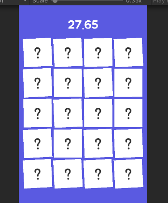
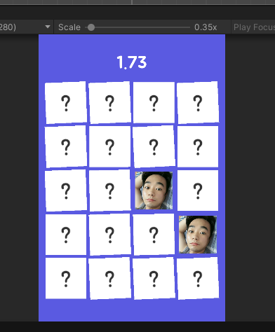

# 🎮 1week_Team9

내일배움캠프 Unity 9기 - **1주차 미니 프로젝트** (9조)  
이 저장소는 9조의 미니 프로젝트 개발을 위한 GitHub 저장소입니다.

---

## 👥 조원
| 이름       | 개발 챕터   |
|------------|------------|
| 이종민B     |            |
| 김가람      |   ---      |
| 조성득      |            |
| 김상훈      |            |
| 임연준      |            |

---

## 🎲 게임 소개

# 🃏 카드 뒤집기 게임 (Memory Flip Game)

> 제한 시간 안에 모든 짝을 맞춰라!  
> 기억력과 순발력을 겨루는 심플하지만 중독성 있는 카드 매칭 게임 🎮

---
## 📸 게임 화면 예시

| 초기화면 | 카드 일부 공개 | 정답 매칭 성공 |
|-----------|----------------|----------------|
|  |  |  |

## 🔧 구현 기능

### ⏳ 제한 시간 시스템
- 게임 상단에 남은 시간 표시
- 시간이 0이 되면 자동으로 게임 종료

### 📦 카드 생성 및 배치
- 원하는 갯수만큼 카드 자동 생성
- `GridLayoutGroup`을 사용하여 깔끔한 정렬

### 🎲 이미지 랜덤 배치
- 사전에 등록된 이미지 중 무작위로 카드에 2장씩 배치

### 🌀 카드 뒤집기 애니메이션
- 클릭 시 카드가 회전하며 이미지 표시
- `LeanTween`, `DOTween`을 활용한 자연스러운 전환 효과

### ✅ 매칭 판정 로직
- 두 장의 카드가 동일 이미지일 경우 고정
- 다를 경우 일정 시간 후 다시 뒤집힘

### 🏁 게임 클리어 조건
- 제한 시간 내 모든 카드 짝 맞추면 클리어
- 클리어 시 메시지/애니메이션 출력

### 🔊 사운드 효과
- 게임 시작 시 효과음 재생
- 카드 클릭, 정답/오답 시 각각 다른 효과음 구현

### 🗂️ 이미지 관리 코드
- 이미지 리스트를 스크립트에서 관리 및 랜덤 셔플
- 리소스 최적화를 위한 분리 로딩 구조

### 🌟 스테이지 선택 / 해금 시스템
- 기본 스테이지 외 추가 난이도 구현
- 이전 스테이지 클리어 시 다음 스테이지 해금
- 스테이지별 카드 수/시간 차등 적용

---

## 🛠️ 사용된 툴

- Unity (버전 2022.3.17f1)
- C#

---

